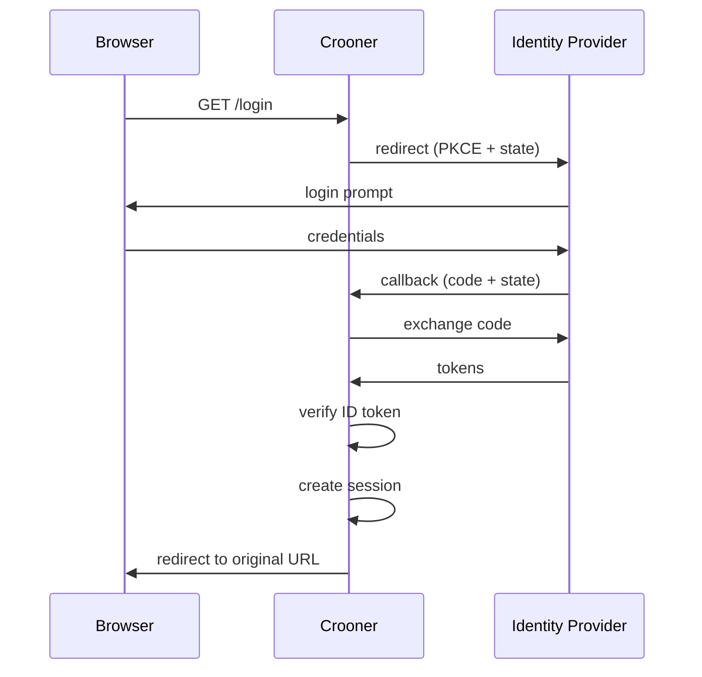

# Crooner

[](https://pkg.go.dev/github.com/catgoose/crooner)
[](https://opensource.org/licenses/MIT)


<!--toc:start-->

- [Crooner](#crooner)
  - [What Is This?](#what-is-this)
  - [Features](#features)
  - [Installation](#installation)
  - [Quick Start Example](#quick-start-example)
  - [Configuration](#configuration)
    - [Session Management (Best Practice)](#session-management-best-practice)
    - [Content Security Policy (CSP) and Security Headers](#content-security-policy-csp-and-security-headers)
      - [Default Security Header Values](#default-security-header-values)
    - [Session Configuration: Functional Options](#session-configuration-functional-options)
      - [Available Options](#available-options)
      - [Example Usage](#example-usage)
  - [Advanced Usage](#advanced-usage)
    - [Bring Your Own Router](#bring-your-own-router)
    - [Custom SessionManager](#custom-sessionmanager)
      - [Example: Redis Implementation](#example-redis-implementation)
  - [Security Best Practices](#security-best-practices)
  - [Session Lifetime Recommendations](#session-lifetime-recommendations)
  - [Setting Session Lifetime](#setting-session-lifetime)
  - [Retrieving the Session Cookie Name](#retrieving-the-session-cookie-name)
    - [Type-Specific Session Helper Functions](#type-specific-session-helper-functions)
      - [Available Helpers](#available-helpers)
      - [Usage Example](#usage-example)
    - [Error Types](#error-types)
  - [Development and the Makefile](#development-and-the-makefile)
    - [About the example errors in docs](#about-the-example-errors-in-docs)
  - [Testing](#testing)
  - [Authentication Flow](#authentication-flow)
    - [How the Flow Works](#how-the-flow-works)
      - [Example Flow](#example-flow)
      - [Note for Development](#note-for-development)
  - [Questions? PRs?](#questions-prs)
  - [License](#license)
  <!--toc:end-->

Crooner is an OIDC/OAuth2 client library for Go web applications using standard `net/http`. It handles PKCE login, callbacks, and session management with pluggable backends and secure defaults. Works with any OIDC-compliant provider -- Azure AD, Google, Okta, Auth0, Keycloak, etc.

## Why

**Without crooner:**

```go
provider, _ := oidc.NewProvider(ctx, issuerURL)
oauth2Config := &oauth2.Config{
    ClientID:     os.Getenv("OIDC_CLIENT_ID"),
    ClientSecret: os.Getenv("OIDC_CLIENT_SECRET"),
    RedirectURL:  os.Getenv("OIDC_REDIRECT_URL"),
    Endpoint:     provider.Endpoint(),
    Scopes:       []string{oidc.ScopeOpenID, "profile", "email"},
}
verifier := provider.Verifier(&oidc.Config{ClientID: oauth2Config.ClientID})

// Generate PKCE challenge
codeVerifier := generateRandomString(64)
codeChallenge := sha256URLEncode(codeVerifier)

// Generate state, store in session, build auth URL...
state := generateRandomString(32)
session.Set(r, "oauth_state", state)
session.Set(r, "pkce_verifier", codeVerifier)
http.Redirect(w, r, oauth2Config.AuthCodeURL(state,
    oauth2.SetAuthURLParam("code_challenge", codeChallenge),
    oauth2.SetAuthURLParam("code_challenge_method", "S256"),
), http.StatusFound)

// Then write the callback handler: validate state, exchange code with
// verifier, verify ID token, extract claims, set session, redirect...
```

**With crooner:**

```go
sessionMgr, scsMgr, _ := crooner.NewSCSManager(
    crooner.WithPersistentCookieName(secret, appName),
    crooner.WithLifetime(12*time.Hour),
)
authHandler, _ := crooner.NewAuthConfig(ctx, &crooner.AuthConfigParams{
    IssuerURL:    os.Getenv("OIDC_ISSUER_URL"),
    ClientID:     os.Getenv("OIDC_CLIENT_ID"),
    ClientSecret: os.Getenv("OIDC_CLIENT_SECRET"),
    RedirectURL:  os.Getenv("OIDC_REDIRECT_URL"),
    SessionMgr:   sessionMgr,
})
handler = authHandler.Middleware()(mux)
handler = scsMgr.LoadAndSave(handler)
// Login, callback, logout, PKCE, state, session -- all handled.
```

## What Is This?

Crooner provides OIDC/OAuth2 authentication for Go web applications. It uses standard `net/http` patterns (`http.Handler`, `http.HandlerFunc`, middleware as `func(http.Handler) http.Handler`) with no framework dependencies beyond the Go standard library.

## Philosophy

> _The student asked the master: "How do I manage authentication state?" The master replied: "The session is on the server. The cookie is on the client. The identity provider is someone else's problem." The student said: "But what about refresh tokens and--" The master had already returned a 302._

Authentication is plumbing. Good plumbing disappears -- you turn the handle, water comes out, you don't think about the pipes. Crooner is the pipes.

- **Standard net/http, nothing else.** Middleware is `func(http.Handler) http.Handler`. Session data lives in `context.Context`. No framework coupling, no interface pollution, no clever abstractions that collapse when you need to debug a 3 AM token expiry.
- **The server holds the session.** The client gets a cookie. The cookie is opaque. The session contains the identity. This is how it has always worked. This is how it should work. The client does not need to know what a JWT is. The client does not want to know what a JWT is.
- **PKCE by default, not by configuration.** The secure path is the only path. You don't opt into PKCE. You don't opt into state validation. You don't opt into cookie security flags. These are not features. They are the floor.
- **Pluggable where it matters, opinionated where it doesn't.** Session backends are pluggable (SCS, Redis, SQLite, your own). The OIDC flow is not. You don't get to skip the state check. You don't get to store tokens in localStorage. Some choices are too important to be configurable.

Crooner follows the [dothog design philosophy](https://github.com/catgoose/dothog/blob/main/PHILOSOPHY.md): the server controls state, the protocol does the work, and the developer writes less code because the defaults are already correct.

## Features

- **PKCE/OIDC login for any provider**
- **Pluggable session management** (SCS, custom)
- **Configurable Content Security Policy (CSP)**
- **Secure, non-guessable session cookies**
- **Standard net/http -- no framework dependency**
- **Preserves original URLs (including query strings) through login and callback**
- **Reverse proxy friendly authentication flow**
- **Automatic recovery from lost session state** (e.g., after server restart)

## Installation

```bash
go get github.com/catgoose/crooner@latest
```

## Quick Start Example

```go
package main

import (
	"context"
	"fmt"
	"log"
	"net/http"
	"os"
	"time"

	crooner "github.com/catgoose/crooner"
)

type AppConfig struct {
	SessionSecret string
	AppName       string
	CroonerConfig *crooner.AuthConfigParams
	SessionMgr    crooner.SessionManager
}

func LoadAppConfig() (*AppConfig, error) {
	secret := os.Getenv("SESSION_SECRET")
	if secret == "" {
		return nil, fmt.Errorf("SESSION_SECRET is required")
	}
	appName := "myApp"

	croonerConfig := &crooner.AuthConfigParams{
		IssuerURL:         os.Getenv("OIDC_ISSUER_URL"),
		ClientID:          os.Getenv("OIDC_CLIENT_ID"),
		ClientSecret:      os.Getenv("OIDC_CLIENT_SECRET"),
		RedirectURL:       os.Getenv("OIDC_REDIRECT_URL"),
		LogoutURLRedirect: os.Getenv("OIDC_LOGOUT_REDIRECT_URL"),
		LoginURLRedirect:  os.Getenv("OIDC_LOGIN_REDIRECT_URL"),
		AuthRoutes: &crooner.AuthRoutes{
			Login:    "/login",
			Logout:   "/logout",
			Callback: "/callback",
		},
		SecurityHeaders: &crooner.SecurityHeadersConfig{
			ContentSecurityPolicy:   "default-src 'self'",
			XFrameOptions:           "DENY",
			XContentTypeOptions:     "nosniff",
			ReferrerPolicy:          "strict-origin-when-cross-origin",
			XXSSProtection:          "1; mode=block",
			StrictTransportSecurity: "max-age=63072000; includeSubDomains; preload",
		},
	}

	return &AppConfig{
		SessionSecret: secret,
		AppName:       appName,
		CroonerConfig: croonerConfig,
	}, nil
}

func main() {
	appConfig, err := LoadAppConfig()
	if err != nil {
		log.Fatalf("failed to load app config: %v", err)
	}

	mux := http.NewServeMux()

	sessionMgr, scsMgr, err := crooner.NewSCSManager(
		crooner.WithPersistentCookieName(appConfig.SessionSecret, appConfig.AppName),
		crooner.WithLifetime(12*time.Hour),
		crooner.WithCookieDomain("example.com"),
	)
	if err != nil {
		log.Fatalf("failed to initialize session manager: %v", err)
	}
	appConfig.SessionMgr = sessionMgr
	appConfig.CroonerConfig.SessionMgr = sessionMgr

	ctx := context.Background()
	authHandler, err := crooner.NewAuthConfig(ctx, appConfig.CroonerConfig)
	if err != nil {
		log.Fatalf("failed to initialize Crooner authentication: %v", err)
	}

	// Register auth routes (login, callback, logout) on the mux
	authHandler.SetupAuth(mux)

	mux.HandleFunc("GET /", func(w http.ResponseWriter, r *http.Request) {
		w.Write([]byte("Hello, Crooner!"))
	})

	// Build middleware chain: session loading -> auth middleware -> mux
	var handler http.Handler = mux
	handler = authHandler.Middleware()(handler)
	handler = scsMgr.LoadAndSave(handler)

	port := os.Getenv("PORT")
	if port == "" {
		port = "8080"
	}
	log.Fatal(http.ListenAndServe(":"+port, handler))
}
```

## Configuration

### Session Management (Best Practice)

- Use a strong, random `SESSION_SECRET` (set via env/config).
- Use a unique `AppName` per app.
- Set a persistent, non-guessable cookie name using `crooner.WithPersistentCookieName(secret, appName)` when creating your session manager:

  ```go
  sessionMgr, scsMgr, err := crooner.NewSCSManager(
  	crooner.WithPersistentCookieName(secret, appName),
  	// ...other options...
  )
  ```

- `NewSCSManager` applies secure defaults. Only reach for advanced config when you have special requirements.

### Content Security Policy (CSP) and Security Headers

Configure your security headers via `SecurityHeadersConfig`. Empty fields use secure defaults.

```go
params := &crooner.AuthConfigParams{
	// ... other config ...
	SecurityHeaders: &crooner.SecurityHeadersConfig{
		ContentSecurityPolicy:   "default-src 'self'",
		XFrameOptions:           "DENY",
		XContentTypeOptions:     "nosniff",
		ReferrerPolicy:          "strict-origin-when-cross-origin",
		XXSSProtection:          "1; mode=block",
		StrictTransportSecurity: "max-age=63072000; includeSubDomains; preload",
	},
}
```

The `UserClaim` field controls which ID token claim is used as the session user -- default is `"email"`. If your provider does not provide email, use `"preferred_username"` or `"upn"`:

```go
params := &crooner.AuthConfigParams{
	// ... other config ...
	UserClaim: "preferred_username",
}
```

Crooner tries your claim first, then falls back to `email` and `preferred_username`.

#### Default Security Header Values

| Header                    | Default Value                     |
| ------------------------- | --------------------------------- |
| Content-Security-Policy   | `default-src 'self'`              |
| X-Frame-Options           | `DENY`                            |
| X-Content-Type-Options    | `nosniff`                         |
| Referrer-Policy           | `strict-origin-when-cross-origin` |
| X-XSS-Protection          | `1; mode=block`                   |
| Strict-Transport-Security | _(not set by default)_            |

- Override a header by setting the field in `SecurityHeadersConfig`.
- Set `Strict-Transport-Security` only when your app is always served over HTTPS.

### Session Configuration: Functional Options

Crooner uses idiomatic Go functional options for session config.

#### Available Options

| Option                                             | Description                                                                                               |
| -------------------------------------------------- | --------------------------------------------------------------------------------------------------------- |
| `WithPersistentCookieName(secret, appName string)` | Sets a non-guessable, persistent cookie name using your secret and app name (recommended for production). |
| `WithCookieName(name string)`                      | Sets a custom cookie name.                                                                                |
| `WithCookieDomain(domain string)`                  | Sets the cookie domain.                                                                                   |
| `WithCookiePath(path string)`                      | Sets the cookie path.                                                                                     |
| `WithCookieSecure(secure bool)`                    | Sets the Secure flag.                                                                                     |
| `WithCookieHTTPOnly(httpOnly bool)`                | Sets the HttpOnly flag.                                                                                   |
| `WithCookieSameSite(sameSite http.SameSite)`       | Sets the SameSite mode.                                                                                   |
| `WithLifetime(lifetime time.Duration)`             | Sets the session lifetime.                                                                                |
| `WithStore(store scs.Store)`                       | Sets a custom session store backend (e.g., Redis).                                                        |

#### Example Usage

```go
sessionMgr, scsMgr, err := crooner.NewSCSManager(
	crooner.WithPersistentCookieName(appConfig.SessionSecret, appConfig.AppName),
	crooner.WithLifetime(12*time.Hour),
	crooner.WithCookieDomain("example.com"),
)
if err != nil {
	log.Fatalf("failed to initialize session manager: %v", err)
}
```

## Advanced Usage

Use `crooner.DefaultSecureSessionConfig()` and pass it to `crooner.NewSCSManagerWithConfig(cfg)` for advanced session configuration.

Use `crooner.RequireAuth(sessionMgr, routes)` as middleware to protect routes:

```go
handler := crooner.RequireAuth(sessionMgr, routes)(mux)
```

```go
cfg := crooner.DefaultSecureSessionConfig()
cfg.CookieName = "crooner-" + myCustomSuffix
cfg.Lifetime = 7 * 24 * time.Hour
cfg.CookieDomain = ".example.com"
cfg.CookieSameSite = http.SameSiteStrictMode
cfg.CookieSecure = true
sessionMgr, scsMgr, err := crooner.NewSCSManagerWithConfig(cfg)
if err != nil {
	log.Fatalf("failed to initialize session manager: %v", err)
}
```

### Bring Your Own Router

Since `NewAuthConfig` does not require a `*http.ServeMux`, you can use any router
that implements `http.Handler`. Call the individual handler methods directly:

```go
authHandler, err := crooner.NewAuthConfig(ctx, params)
if err != nil {
	log.Fatal(err)
}

// chi, gorilla/mux, or any router
r := chi.NewRouter()
r.Get(params.AuthRoutes.Login, authHandler.LoginHandler())
r.Get(params.AuthRoutes.Callback, authHandler.CallbackHandler())
r.Post(params.AuthRoutes.Logout, authHandler.LogoutHandler())

// Or for net/http, use the convenience method:
// mux := http.NewServeMux()
// authHandler.SetupAuth(mux)
```

### Custom SessionManager

Implement the `SessionManager` interface for custom backends (DB, Redis, etc.).

#### Example: Redis Implementation

```go
package myapp

import (
	"encoding/json"
	"net/http"
	"time"

	"github.com/go-redis/redis/v8"
)

type RedisSessionManager struct {
	Client *redis.Client
	Prefix string
	TTL    time.Duration
}

func (r *RedisSessionManager) sessionKey(req *http.Request, key string) string {
	sessionID := req.Header.Get("X-Session-ID")
	return r.Prefix + sessionID + ":" + key
}

func (r *RedisSessionManager) Get(req *http.Request, key string) (any, error) {
	ctx := req.Context()
	val, err := r.Client.Get(ctx, r.sessionKey(req, key)).Result()
	if err == redis.Nil {
		return nil, nil
	} else if err != nil {
		return nil, err
	}
	var result any
	if err := json.Unmarshal([]byte(val), &result); err != nil {
		return nil, err
	}
	return result, nil
}

func (r *RedisSessionManager) Set(req *http.Request, key string, value any) error {
	ctx := req.Context()
	data, err := json.Marshal(value)
	if err != nil {
		return err
	}
	return r.Client.Set(ctx, r.sessionKey(req, key), data, r.TTL).Err()
}

func (r *RedisSessionManager) Delete(req *http.Request, key string) error {
	ctx := req.Context()
	return r.Client.Del(ctx, r.sessionKey(req, key)).Err()
}

func (r *RedisSessionManager) Clear(req *http.Request) error {
	return nil // Implement: clear all session keys for user
}

func (r *RedisSessionManager) Invalidate(req *http.Request) error {
	return nil // Implement: invalidate session
}

func (r *RedisSessionManager) ClearInvalidate(req *http.Request) error {
	if err := r.Clear(req); err != nil {
		return err
	}
	return r.Invalidate(req)
}
```

To use your custom Redis session manager with Crooner:

```go
import (
	crooner "github.com/catgoose/crooner"
	"github.com/go-redis/redis/v8"
	"time"
)

func main() {
	mux := http.NewServeMux()
	redisClient := redis.NewClient(&redis.Options{
		Addr: "localhost:6379",
	})
	sessionMgr := &myapp.RedisSessionManager{
		Client: redisClient,
		Prefix: "crooner:",
		TTL:    24 * time.Hour,
	}
	croonerConfig := &crooner.AuthConfigParams{
		// ...other config...
		SessionMgr: sessionMgr,
	}
	// ...rest of your setup...
}
```

## Security Best Practices

- Use a strong, random session secret (32+ bytes)
- Use a unique, non-guessable cookie name per app (`crooner-<hash>`)
- Rotate the session secret when you need everybody out
- HTTPS, HttpOnly, SameSite, Secure cookies
- Configure CSP for your frontend's needs
- Keep `ErrorConfig.ShowDetails` **false** in production so internal error details never hit the client
- Behind a reverse proxy (TLS termination)? Trust proxy headers (`X-Forwarded-Proto`, `X-Forwarded-Host`) so your app gets the right scheme and host for redirects and HSTS

## Session Lifetime Recommendations

- **8-12 hours:** Sensitive stuff -- admin, finance, healthcare
- **12-24 hours:** Good default for most business apps
- **48 hours (2 days):** When convenience matters
- **7+ days:** "Remember me" only -- use with caution

## Setting Session Lifetime

```go
cfg := crooner.DefaultSecureSessionConfig()
suffix := crooner.PersistentCookieSuffix(appConfig.SessionSecret, appConfig.AppName)
cfg.CookieName = "crooner-" + suffix
cfg.Lifetime = 24 * time.Hour
```

- Destroy the session on logout
- Regenerate the session on login or privilege change
- The logout route is **POST** only. Use a form with `method="post"` and `action="/logout"` for your logout button.

### CSRF Protection

Crooner does not include CSRF middleware. The OAuth login flow is protected by the `state` parameter (stored in session and validated on callback). For CSRF protection on your own routes (POST, PUT, PATCH, DELETE), use [gorilla/csrf](https://github.com/gorilla/csrf) or a similar library.

## Retrieving the Session Cookie Name

Sometimes the cookie name is generated for you (e.g. with `WithPersistentCookieName`). Use `GetCookieName()` on the session manager:

```go
sessionMgr, _, err := crooner.NewSCSManager(
	crooner.WithPersistentCookieName(appConfig.SessionSecret, appConfig.AppName),
	crooner.WithLifetime(24*time.Hour),
)
if err != nil {
	// handle error
}
cookieName := sessionMgr.GetCookieName()
```

### Type-Specific Session Helper Functions

Crooner provides type-specific helpers for session values. They work with any `SessionManager` and return an error if the value is missing or wrong type.

#### Available Helpers

- `GetString(sm SessionManager, r *http.Request, key string) (string, error)`
- `GetInt(sm SessionManager, r *http.Request, key string) (int, error)`
- `GetBool(sm SessionManager, r *http.Request, key string) (bool, error)`

#### Usage Example

```go
func myHandler(w http.ResponseWriter, r *http.Request) {
	username, err := crooner.GetString(sessionMgr, r, "username")
	if err != nil {
		http.Error(w, "Unauthorized", 401)
		return
	}
	w.Write([]byte("Hello, " + username))
}
```

Crooner does **not** store the OAuth2 access token or refresh token in the session by default. Only the user identifier (and any claims you map via `SessionValueClaims`) are persisted. If your app needs to call APIs on behalf of the user, you must persist tokens yourself.

### Error Types

Typed errors for inspection with `errors.As` or `errors.Is`:

- **ConfigError** -- something wrong with the setup (e.g. from `NewAuthConfig`). Check with `crooner.IsConfigError(err)` or `errors.As(err, &cfgErr)`.
- **AuthError** -- token exchange or ID token did not check out. Check with `crooner.IsAuthError(err)` or `crooner.AsAuthError(err)`.
- **ChallengeError** -- PKCE or state generation failed. Check with `crooner.IsChallengeError(err)` or `crooner.AsChallengeError(err)`.
- **SessionError** -- session get/set or wrong type. Check with `crooner.IsSessionError(err)` or `crooner.AsSessionError(err)`.
- **State decode errors** -- invalid OAuth state. Use `errors.Is(err, crooner.ErrInvalidStateFormat)` or `errors.Is(err, crooner.ErrInvalidStateData)`.

The built-in auth routes respond with **RFC 7807 / RFC 9457 problem details**: JSON with `type`, `title`, `status`, and optional `detail`, plus extensions. **Content-Type** is `application/problem+json`. See [docs/errors.md](docs/errors.md) for the full list.

| type URI                                                         | Meaning                                                      |
| ---------------------------------------------------------------- | ------------------------------------------------------------ |
| [docs/errors.md#config](docs/errors.md#config)                   | Configuration error                                          |
| [docs/errors.md#auth](docs/errors.md#auth)                       | Auth / token / ID token error                                |
| [docs/errors.md#challenge](docs/errors.md#challenge)             | PKCE or state generation error                               |
| [docs/errors.md#session](docs/errors.md#session)                 | Session get/set or type error (includes `key`, `reason`)     |
| [docs/errors.md#invalid_state](docs/errors.md#invalid_state)     | Invalid OAuth state payload                                  |
| [docs/errors.md#invalid_request](docs/errors.md#invalid_request) | Invalid callback request (e.g. missing code, nonce mismatch) |
| `about:blank`                                                    | Other or unknown error                                       |

## Development and the Makefile

| Target                    | What it does                                                                                                                                                                                                   |
| ------------------------- | -------------------------------------------------------------------------------------------------------------------------------------------------------------------------------------------------------------- |
| `help`                    | Default. Lists the real targets.                                                                                                                                                                               |
| `build`                   | Builds `bin/oauth-server`, `bin/app`, `bin/simulate`.                                                                                                                                                          |
| `test`                    | Runs `go test ./...`.                                                                                                                                                                                          |
| `verify-docs`             | `git diff --exit-code docs/` -- fails if docs are dirty so CI keeps things real.                                                                                                                               |
| `ci`                      | `build`, `test`, `verify-docs`.                                                                                                                                                                                |
| `install-playwright`      | Install Playwright browsers for `simulate`.                                                                                                                                                                    |
| `pkce-sim`                | Depends on `build`; runs the PKCE simulation script.                                                                                                                                                           |

## Testing

Using Crooner in your app does **not** pull in Playwright. The main module has zero browser deps.

The PKCE simulation lives in the `simulate/` submodule. To run:

```bash
cd simulate && go run github.com/playwright-community/playwright-go/cmd/playwright install --with-deps
cd .. && ./scripts/run-pkce-sim.sh
```

## Authentication Flow

### How the Flow Works

1. **You try to visit a protected page** -- Crooner checks your session. If not logged in, redirects to `/login?redirect=<your real destination>`.
2. **Login Handler** -- Encodes a secret state and your original destination into a base64-encoded package, stashes it in your session, and sends you to the OAuth provider.
3. **Callback** -- After you sign in, the OAuth provider sends you back to `/callback` with your state. Crooner decodes it, checks credentials, and puts you back where you started.
4. **If the Session is Gone** -- If the session state is missing or does not match, Crooner restarts the login flow, keeping your original destination safe.

#### Example Flow

1. You hit `/dashboard?id=42` (not logged in)
2. Crooner sends you to `/login?redirect=/dashboard?id=42`
3. You get sent to the OAuth provider with a state
4. After login, you are back at `/callback?...&state=...`
5. Crooner decodes the state and puts you back at `/dashboard?id=42`

#### Note for Development

If you are using an in-memory session store and you restart the server, your session is gone. Crooner will restart the login flow. For production, use a persistent session store (Redis, SQLite, etc.).

## Architecture

### OAuth2/OIDC flow

```
  browser                    crooner                     IdP
  ───────                    ───────                     ───
     │                          │                         │
     ├── GET /login ──────────► │                         │
     │                          ├── redirect ────────────►│
     │                          │   (PKCE + state)        │
     │   ◄── redirect ─────────┤ ◄── callback ───────────┤
     │       to /callback       │    (code + state)       │
     │                          │                         │
     │                          ├── exchange code ───────►│
     │                          │◄── tokens ──────────────┤
     │                          │                         │
     │                          ├── verify ID token       │
     │                          ├── create session        │
     │   ◄── redirect ─────────┤                         │
     │       to original URL    │                         │
```

<details>
<summary>Mermaid version</summary>



</details>

## Questions? PRs?

Open an issue or send a PR.

## License

MIT
